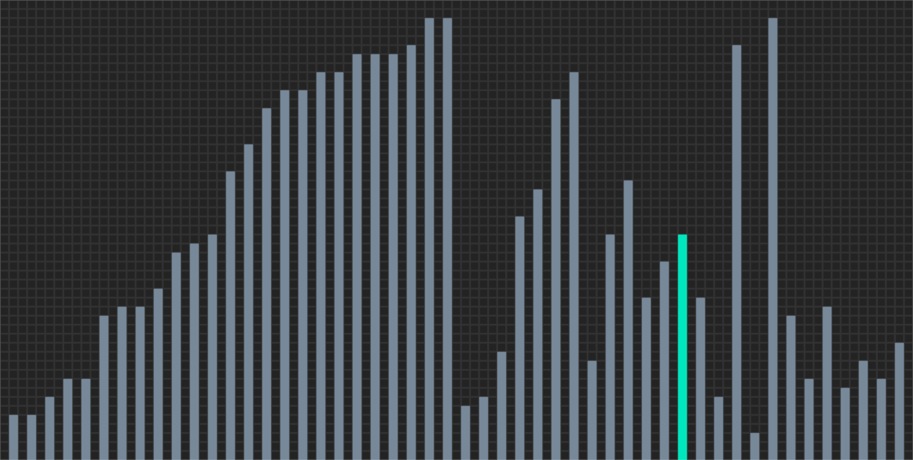

# Sorting Simulator

  
  
A single frame of merge sort being rendered by the simulator

## Introduction

This is a simulator that renders sorting algorithms being performed on randomly generated arrays in real-time. The numbers that are placed within these arrays vary between the GUI's dimensions which can be customized within `settings.py`.

The delay between each frame being rendered can also be modified to your satisfaction. If you customized the GUI to be large, then consider decreasing the delay, otherwise increase the delay if you customized the GUI to be small. This will make the simulation be rendered at a good speed that can help show you the sorting algorithm works.

#### The following sorting algorithms are implemented within the application:
  - Bubble sort
  - Counting sort
  - Heapsort
  - Insertion sort
  - Merge sort
  - Odd-even sort
  - Quicksort
  - Selection sort

## Requirements
- Python 3.10+

## Dependencies
- Pygame 2.1.3.dev8
