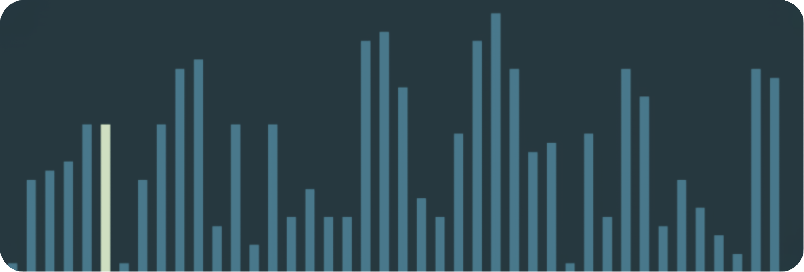

# Sorting Visualizer



## Introduction

This visualizer renders sorting algorithms being performed on randomly generated arrays in real-time.

The length of each rectangle and the rectangle count are proportional to the dimensions of the
screen which can be modified in `settings.py`.

## Getting Started

1). Install dependencies.

```
pip install -r requirements.txt
```

2). Execute `run.py` within the `src` directory while passing an argument of the sorting algorithm.

```
python src/run.py <sorting algorithm>
```

## License

MIT
